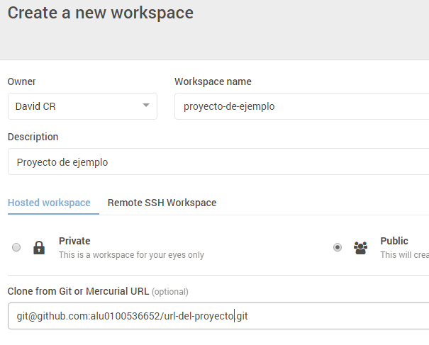

Tutorial NodeJS, Express, Atom, GitHub, Cloud9 y Markdown
======================================================

## Instalación de NodeJS en Windows

Antes de instalar NodeJS en windows, debes tener en cuenta que Node se basa en líneas de comando, por ello debes sentirte cómodo con las herramientas de de línea de comando, como el Windows Command Prompt, PowerShell o Git Shell (que viene instalado con el Github de escritorio para Windows).  


1. Para instalarlo, primero debemos descargar el instalador de la propia página web de [NodeJS](https://nodejs.org/en/)

2. Ejecutar el instalador.

3. Sigue los pasos del instalador y acepta los términos de uso.

4. Reinicia el ordenador. No podrás ejecutarlo hasta que no lo reinicies.

## Instalación de NodeJS en Ubuntu

Para instalar NodeJS en Ubuntu, habrimos un terminal (Ctrl + Alt + T), para tener la versión más actual primero usaremos los siguientes códigos.

> * `sudo apt-get update`
>
> * `sudo apt-get install nodejs`

También será muy importante instalar el **npm**, que se hace con el siguiente comando.

> * `sudo apt-get install npm`

## Instalar Express en Ubuntu y en Windows

Ahora que ya tenemos el **npm** podemos instalar el framework Express, para ello usaremos la siguiente línea de comando.

> * `npm install express --save`


## Instalación del editor de texto Atom

Usaremos **Atom** como editor de texto para el desarrollo de nuestros proyectos, para ello descargamos el instalador en la página oficial de atom, y a continuación ejecutamos el asistente de instalación.


Dado que vamos a utilizar el formato **Markdown** es bueno saber que en **Atom** podremos obtener una preview del contenido de nuestro fichero Markdown ya que incorpora el formato **GitHub Markdown** con el comando:

**Comando**

> * Markdown preview `ctrl+shift+m`
> * Markdown export to HTML `Save As HTML`


## Instalación de GitHub Desktop

GitHub es una plataforma para alojar proyectos utilizando el sistema de control de versiones **Git**. Para instalarlo accedemos a la página oficial de **GitHub** y descargamos el instalador que ejecutaremos posteriormente para iniciar el asistente de instalación.


Una vez instalado configuramos nuestra cuenta de **GitHub** en la aplicación para poder sincronizar nuestro repositorio tanto local como remoto, en caso de no tener cuenta crearemos una en la página de **GitHub**.

## Cloud 9

Es un IDE de desarrollo online, para su uso será necesario crear una cuenta en la página oficial o acceder con las credenciales de GitHub si ya se dispone de una cuenta. Una vez registrados podremos crear proyectos de varias tecnologías como puede ser NodeJS, HTML5, C++, Ruby On Rails, etc.


Si disponemos de algún proyecto en un repositorio de GitHub podremos asociarlo a **Cloud9** para trabajar en él tan solo creando un “`nuevo workspace`” y añadiendo la url *git* del correspondiente repositorio.



Además **Cloud9** permite el trabajo en equipo en el IDE añadiendo miembros a tu workspace.

## Markdown

Markdown es un lenguaje de marcado ligero, lo vamos a utilizar en el editor de texto Atom ya que incorpora por defecto este formato y podremos obtener un live preview mientras vamos desarrollando además de poder exportarlo a HTML sin la necesidad de usar un conversor adicional.

Sintaxis:


Encabezados
```
# Encabezado H1
## Encabezado H2
### Encabezado H3
```
Tipografía
```
**Negrita**
*Cursiva*
> Citas
Parrafo separar por lineas en blanco
`Codigo`
```
Recursos
```

* [Links](https://example.com)
```
Listas
```
1. Lista 1
2. Lista 2

* Lista 1
* Lista 2
```

**Recursos:**

* [NodeJS](https://nodejs.org)
* [Express](http://expressjs.com)
* [Atom IDE](https://atom.io)
* [GitHub Desktop](https://desktop.github.com)
* [GitHub Pages](https://pages.github.com/)
* [Cloud 9 IDE](https://c9.io)
* [Markdown](http://daringfireball.net/projects/markdown/)
* [Resultado del Markdown HTML](http://alu0100536652.github.io/Tutorial-STW/)
